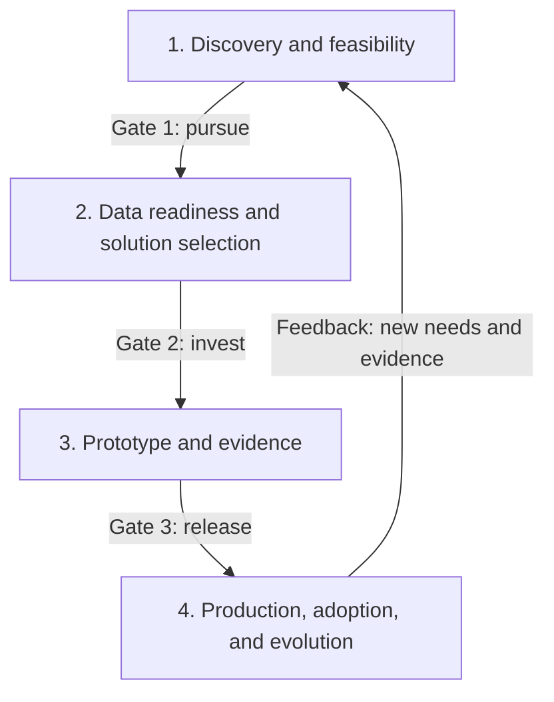

# AI SA Delivery Playbook

## A reusable method

This playbook joins the existing courses into one delivery method. It moves from a valuable problem to an operable AI system through four evidence-based phases.

It is not a rigid waterfall. Teams can run activities in parallel, revisit earlier assumptions, and deliver in increments. Gates make risk and evidence visible; they do not prevent learning.

## Phase 1: Discovery and feasibility

### Question it answers

Is there a valuable, bounded problem that AI can address at acceptable risk and cost?

### Entry conditions

- A named sponsor and problem owner are available.
- A user group and current workflow can be observed or described.
- The team can access enough subject-matter expertise to challenge assumptions.

### Activities

1. Map users, tasks, pain points, current controls, and the baseline outcome.
2. Define success measures, non-goals, constraints, volumes, latency needs, and failure costs.
3. Compare AI with rules, search, workflow redesign, or no change.
4. Identify affected stakeholders, harms, data classes, and accountable risk owners.
5. Test feasibility with representative examples and a quick dependency review.
6. State assumptions, unknowns, and the cheapest experiments that could disprove them.

### Evidence pack and exit criteria

The evidence pack contains an opportunity brief, current-state map, baseline measures, initial risk classification, stakeholder map, and feasibility findings. Exit when the sponsor and risk owners agree on a bounded outcome, measurable value, explicit non-goals, and a justified decision to pursue, pause, or stop.

**Course links:** [AI and Machine Learning Basics](../level101/ai_ml_basics.md), [Systems Design](../level101/systems_design.md), [The Practice: Discovery to Production](../level102/solution_architecture_practice.md), and [Governance, Safety, and Responsible AI](../level102/governance.md).

## Phase 2: Data readiness and solution selection

### Question it answers

Which solution pattern can meet the requirement with available data, controls, skills, and budget?

### Entry conditions

- Phase 1 has a named outcome, baseline, constraints, and owner.
- Candidate data owners and systems of record are known.
- Security, data, engineering, and product representatives can review options.

### Activities

1. Profile representative data for quality, coverage, permissions, freshness, lineage, and retention.
2. Decide whether the need calls for deterministic software, search, ML, RAG, an agent, or a combination.
3. Define trust boundaries, identities, data flows, human approvals, and threat controls.
4. Compare build, managed service, and vendor options against weighted criteria.
5. Estimate demand, unit cost, total cost range, operational effort, and exit costs.
6. Record key choices, rejected options, assumptions, and validation experiments in ADRs.

### Evidence pack and exit criteria

The evidence pack contains a data-readiness review, target architecture, threat model, vendor/model matrix, cost model, ADRs, and updated risk register. Exit when owners confirm usable data and permissions, a preferred design, affordable operating assumptions, testable quality targets, and controls for material risks.

**Course links:** [Data for AI](../level101/data.md), [Security Fundamentals](../level101/security.md), [RAG Architecture](../level102/rag_architecture.md), [Agents and Orchestration](../level102/agents.md), and [Cost Engineering for AI](../level102/cost_engineering.md).

## Phase 3: Prototype and evidence

### Question it answers

Does the smallest realistic implementation produce enough evidence to justify production investment?

### Entry conditions

- The preferred architecture and the decisions it must validate are documented.
- Representative, authorised test data and subject-matter reviewers are available.
- Metrics, acceptance thresholds, experiment budget, timebox, and stop conditions are agreed.

### Activities

1. Build a thin end-to-end slice with production-relevant interfaces and controls.
2. Create a versioned evaluation set with common, difficult, unsafe, and permission-sensitive cases.
3. Measure the baseline and candidates for quality, latency, cost, safety, and retrieval behaviour.
4. Run structured expert and user reviews; record errors by meaningful slice.
5. Exercise abuse cases, dependency failure, fallback behaviour, and observability.
6. Analyse results against pre-agreed gates and update architecture, costs, and risks.

### Evidence pack and exit criteria

The evidence pack contains reproducible prototype versions, evaluation data and rubric, experiment report, traces, cost observations, failure findings, and a recommendation. Exit when the decision-makers accept the evidence to proceed, redesign, or stop. Proceeding requires met thresholds or explicitly accepted residual risk, not a persuasive demo.

**Course links:** [Evaluation, Observability, and Guardrails](../level102/evaluation.md), [RAG Architecture](../level102/rag_architecture.md), [Cost Engineering for AI](../level102/cost_engineering.md), and [The Practice: Discovery to Production](../level102/solution_architecture_practice.md).

## Phase 4: Production, adoption, and evolution

### Question it answers

Can people adopt the service and can the organisation operate, govern, and improve it safely?

### Entry conditions

- Prototype evidence supports the release decision.
- Product scope, service ownership, funding, and risk acceptance are named.
- Production controls, SLOs, support model, and rollout strategy have owners.

### Activities

1. Build repeatable deployment, versioning, testing, rollback, and environment promotion.
2. Complete security, privacy, resilience, capacity, recovery, and supplier reviews.
3. Run UAT against user workflows and train users, support staff, and approvers.
4. Release progressively with feature flags, fallback paths, and stop criteria.
5. Monitor quality, safety, latency, reliability, adoption, drift, and unit cost by useful slice.
6. Review incidents and user feedback, refresh evaluations, and feed new needs into discovery.

### Evidence pack and exit criteria

The evidence pack contains deployment and UAT approvals, runbooks, dashboards, alerts, service objectives, data/model/prompt versions, rollback evidence, training material, and support handover. Exit into normal operations when service and risk owners accept readiness, support can respond, users understand limitations, and review dates are scheduled.

**Course links:** [MLOps and LLMOps](../level102/llmops.md), [Evaluation, Observability, and Guardrails](../level102/evaluation.md), [Governance, Safety, and Responsible AI](../level102/governance.md), and [Systems Design](../level101/systems_design.md).

## Where the architect signs off

The architect signs the technical recommendation and makes unresolved trade-offs visible. Business and risk owners retain their own accountability.

| Phase | Decision | Required evidence | Who participates |
|---|---|---|---|
| Discovery and feasibility | Pursue, reshape, pause, or stop | Opportunity brief, baseline, feasibility findings, initial risks | Product, sponsor, SME, architect, data owner, security/risk |
| Data readiness and solution selection | Select the pattern and fund a prototype | Data review, option matrix, architecture, ADRs, threat and cost models | Architect, product, data, security/privacy, engineering, operations, procurement/vendor management |
| Prototype and evidence | Proceed to production, redesign, or stop | Evaluation report, traces, failure tests, observed costs, updated risks | Product, SME reviewers, architect, engineering, data, security, risk owner, representative users |
| Production, adoption, and evolution | Approve release and operating model | UAT, release plan, SLOs, rollback proof, runbooks, dashboards, accepted residual risks | Product/service owner, architect, engineering, operations/support, security/privacy, data, change/adoption lead, risk owner |

## Worked scenario: support knowledge assistant

A service team wants an assistant that answers staff questions from approved internal support articles and cites its sources. Discovery finds that searching takes too long, but an incorrect answer can misroute a customer case. The non-goals are autonomous ticket updates and answers from unrestricted internet content.

The team selects permission-aware RAG after checking article ownership, access labels, freshness, and deletion. The prototype compares ordinary search with two retrieval configurations on a versioned set of real, anonymised questions. Reviewers score groundedness and usefulness without seeing the candidate name.

**All figures below are illustrative, not defaults or guarantees.** The MVP gate requires:

- at least **85%** of eligible answers rated useful by two support SMEs;
- at least **95%** citation correctness on the evaluation set;
- **zero** cross-team permission leaks in the access-control test set;
- p95 response latency below **5 seconds** under the agreed test load;
- model and retrieval cost below **R1.50 per answered question**;
- an abstention or search fallback when evidence is missing; and
- at least **60%** weekly use by the pilot group after four weeks, with no rise in reopened cases.

The pilot launches to one support group behind a feature flag. Monitoring separates answer quality, retrieval misses, permission denials, latency, cost, and adoption. A rise in stale citations triggers a content-owner workflow; a new request for ticket updates returns to discovery because it changes authority and risk.

## Controlled acceleration

The workflow may accelerate or skip a gate only when the accountable risk owner records why, what evidence is absent, the resulting exposure, compensating controls, and the date for review. Urgency does not silently transfer accountability to the delivery team.
