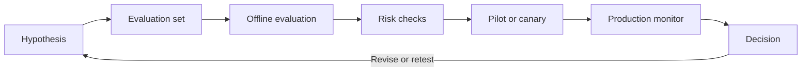

# Evidence, benchmarking, and AI QA

## What are you measuring?

AI quality is not one number. **Model quality** measures the model on a bounded task, such as classification recall or summary factuality. **System quality** measures the complete service, including retrieval, guardrails, latency, availability, and integrations. **Business outcome** measures whether the service changes something valuable, such as resolution time, appeal rate, or customer satisfaction. A better model score may not improve the business outcome if the workflow is slow or users do not trust it.

Useful terms:

- A **false positive** occurs when the system predicts a condition that is not present.
- A **false negative** occurs when the system misses a condition that is present.
- A **human baseline** is measured human performance on the same task, examples, rubric, and conditions used for the system.
- A **benchmark** is a repeatable comparison of candidates against a defined dataset and metrics.
- **Acceptance criteria** are measurable conditions that must be met before a release or decision proceeds.

Review the foundations in [AI and ML basics](../level101/ai_ml_basics.md) before choosing metrics.

## A practical evidence loop

Start with a falsifiable hypothesis, not a preferred model. Version the data, scoring rules, prompts, models, and system configuration so another person can reproduce the decision.

1. **Hypothesis:** state the expected improvement, target population, metric, and minimum useful change.
2. **Evaluation set:** sample real task types and deliberately add rare, difficult, multilingual, and high-impact cases. Keep a holdout set.
3. **Offline evaluation:** compare the candidate with the current system and human baseline using identical inputs.
4. **Risk checks:** test privacy, security, harmful outputs, subgroup performance, and plausible abuse.
5. **Pilot or canary:** expose a small, controlled population with stop conditions and human oversight.
6. **Production monitor:** watch input drift, outcomes, failures, latency, cost, and incidents by meaningful slice.
7. **Decision:** launch, limit, revise, or stop. Record the evidence, owner, date, and uncertainty.

See [Evaluation, observability, and guardrails](../level102/evaluation.md), [Governance](../level102/governance.md), and [MLOps and LLMOps](../level102/llmops.md) for implementation detail.

## A concise evidence rubric

Score each dimension from **1 (unacceptable)** to **5 (strong)** and attach evidence rather than relying on an overall impression.

| Dimension | Question to answer |
| --- | --- |
| Quality | Does the output correctly complete the intended task? |
| Groundedness | Can material claims be traced to approved evidence? |
| Safety | Are harmful, private, or prohibited outcomes prevented and handled? |
| Latency | Do typical and tail response times meet the user need? |
| Cost | Is unit and total cost sustainable at expected and peak volume? |
| Equity | Are error rates and user impacts acceptable across relevant groups and languages? |
| Operability | Can teams observe, support, update, and roll back the service? |

Weights change by use case. Safety and false negatives may dominate medical triage; latency may dominate an interactive assistant; groundedness may dominate policy search. Agree weights and minimum gates before comparing systems, and do not let a high average hide a failed safety gate.

## Worked example: toxicity moderation

The following numbers are **illustrative, not deployment guidance**. A platform evaluates a toxicity classifier on 10,000 consented and appropriately governed comments. Human reviewers label examples using a written policy and adjudicate disagreements. The set includes conversational English, multiple South African languages, code-switching, reclaimed language, and dialect varieties.

At threshold 0.70, the classifier flags 900 comments. Review shows 180 are false positives: non-toxic content was blocked, including disproportionate errors on one dialect slice. Of 1,000 comments labelled toxic, it misses 280 false negatives. The team reports precision as 720 / 900 = 80% and recall as 720 / 1,000 = 72%, alongside per-language and per-dialect results.

Lowering the threshold to 0.55 catches more harmful content but increases false positives and appeals. Raising it protects legitimate speech but allows more harmful content through. The team therefore does not choose a threshold from accuracy alone. It routes borderline scores to trained human review, provides an appeal path, monitors overturn rates, and separately tests obfuscated slurs and code-switched inputs. Where a language slice is too small, it records insufficient evidence rather than claiming parity.

Acceptance criteria might require a maximum false-negative rate for severe threats, a maximum false-positive rate by adequately sampled language slice, reviewer agreement above a set threshold, and no material regression from the human baseline. The policy owner, affected-community review, and operational capacity for appeals all inform the final decision.

## Evidence habits

- Report confusion matrices and slices, not accuracy alone.
- Separate measured facts from assumptions and projected business value.
- Record uncertainty, sample limitations, and who labelled the data.
- Predefine stop conditions for pilots and owners for production alerts.
- Re-run evaluations after model, prompt, data, policy, or architecture changes.
