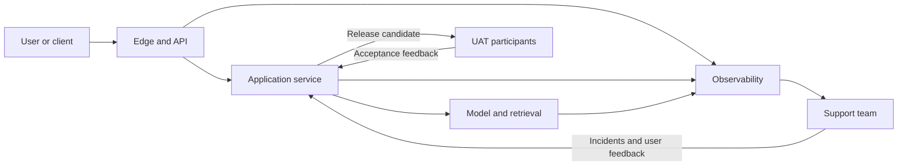

# Production readiness, UAT, and operational handover

## Crossing the PoC-to-production gap

A proof of concept (PoC) shows that an idea can work in a controlled setting. Production requires it to work securely and predictably for real users, at real volume, with named owners when it fails. The gap is usually not another prompt: it is identity, contracts, telemetry, deployment, testing, and support.

Key terms:

- An **API** (application programming interface) is a defined contract through which software exchanges requests and responses.
- **User acceptance testing (UAT)** is validation by representative users that the system supports agreed workflows and acceptance criteria.
- A **service-level indicator (SLI)** is a measured property such as successful-request rate or p95 latency. A **service-level objective (SLO)** is the target for that indicator over a period.
- A **rollback** restores a previously known-good application, model, prompt, configuration, or data version.

Start with [Systems design](../level101/systems_design.md) and [Security fundamentals](../level101/security.md), then use [MLOps and LLMOps](../level102/llmops.md) and [Solution architecture practice](../level102/solution_architecture_practice.md) to shape the release process.

## Production architecture and ownership

Define a JSON API contract with field types, required values, error formats, request IDs, size limits, and examples. Validate both requests and model-generated structured responses. Authenticate the caller, then authorize each requested resource or action; identity alone does not grant access. Apply per-user or per-tenant rate limits, timeouts, and bounded retries.

Use structured logs, metrics, and traces linked by request ID. Redact secrets and personal information. Document the deployment topology: regions, network boundaries, data stores, external dependencies, scaling limits, and failure paths. Version API contracts separately from model, prompt, retrieval index, and policy versions. A rollback plan must state what can be reversed, how data compatibility is preserved, who approves it, and how success is checked.

UAT should use representative roles, devices, assistive technologies, languages, and end-to-end workflows. Include rejection, timeout, escalation, and recovery paths. Name product acceptance authority, on-call owner, support queue, escalation path, and runbook owner. Provide accessible status and error messages, keyboard and screen-reader compatibility where applicable, and incident communication that says what is affected, what users should do, when the next update will arrive, and when service is restored.

## Pre-launch checklist

### Security

- [ ] Authentication and resource-level authorization are tested, including cross-tenant attempts.
- [ ] Secrets are managed outside code; data is encrypted and retention is documented.
- [ ] Inputs, outputs, file types, and tool actions are validated and bounded.
- [ ] Threat modelling, dependency checks, privacy review, and incident contacts are complete.

### Reliability

- [ ] SLIs and SLOs cover availability, error rate, and tail latency; alerts have owners.
- [ ] Load, timeout, retry, dependency-failure, and recovery tests have passed.
- [ ] Rate limits, circuit breakers, idempotency, and graceful degradation are appropriate.
- [ ] Versioned deployment and rollback have been rehearsed with compatible data.

### Product and UAT

- [ ] Acceptance criteria map to representative workflows and users.
- [ ] UAT records pass, fail, evidence, severity, and acceptance owner.
- [ ] Accessibility, language, unsafe-output, and human-escalation paths are tested.
- [ ] Analytics measure user and business outcomes without collecting unnecessary data.

### Operations and support

- [ ] Dashboards link logs, traces, model versions, costs, and user-visible failures.
- [ ] Runbooks cover common alerts, model degradation, dependency loss, and rollback.
- [ ] On-call, support, product, security, and supplier responsibilities are explicit.
- [ ] Status messaging, support scripts, incident templates, and post-incident review are ready.

## Worked example: document summarisation API

All metrics below are **illustrative**. A team exposes `POST /v1/summaries` with a JSON request containing a document reference and requested summary style. The response contains a summary, source references, model version, and request ID. OAuth tokens identify the caller; authorization confirms access to the referenced document. Requests are limited to 20 per minute per user and 5 MB per document.

UAT covers long reports, scanned pages, tables, unsupported files, revoked access, and screen-reader use of the client. The release gate requires 98% schema-valid responses, fewer than 1% critical factual errors on the approved evaluation set, and p95 latency below 8 seconds. The production SLO is 99.5% successful eligible requests per month. Logs retain metadata and error codes, not document text.

A 5% canary compares correction rate, critical errors, p95 latency, and cost per summary with the current version. The team rolls back if critical factual errors exceed 1.5% across 200 reviewed summaries or if the error-rate alert persists for 15 minutes. Support can locate a trace by request ID, offer manual processing, and escalate suspected privacy incidents immediately. Product owns UAT acceptance; platform engineering owns service recovery; the AI team owns model-quality investigation.
