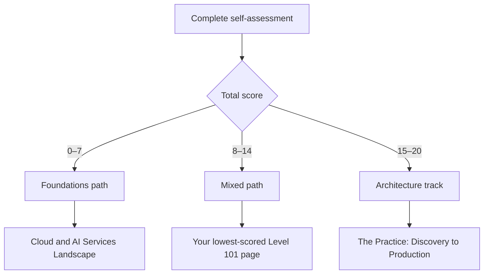

# Start here: choose your path

## Who this is for

Use this page if you are preparing for AI Solutions Architecture work and are unsure where to begin. It suits developers, analysts, architects, product practitioners, and career changers.

This self-assessment is a diagnostic, not a test or certification. Answer honestly, choose a starting path, and reassess after completing practical work. A low score identifies useful next steps; it does not set a ceiling on your progress.

## Ten-question self-assessment

Score every question:

- **0 — New:** I cannot yet explain or perform this task.
- **1 — Developing:** I can explain the basics or complete it with guidance.
- **2 — Applied:** I can complete it independently and explain my choices.

| # | Area | Question | Score |
|---:|---|---|---:|
| 1 | Problem framing | Can I turn a broad request into a user, problem, baseline, measurable outcome, constraints, and non-goals? | [0/1/2] |
| 2 | APIs and web | Can I explain an HTTP request and response, call a JSON API, and handle authentication and errors? | [0/1/2] |
| 3 | Python and Git | Can I change a small Python program, manage dependencies, and use a branch and pull request safely? | [0/1/2] |
| 4 | Cloud | Can I compare IaaS, PaaS, and SaaS and sketch identity, network, compute, storage, and observability components? | [0/1/2] |
| 5 | Data and SQL | Can I query relational data, assess data quality, and choose between exact lookup and semantic search? | [0/1/2] |
| 6 | Security | Can I identify assets and trust boundaries and apply least privilege, secret management, and input/output controls? | [0/1/2] |
| 7 | AI and ML | Can I select a suitable ML task and metric and explain leakage, overfitting, and a held-out test set? | [0/1/2] |
| 8 | LLM and RAG | Can I explain tokens, embeddings, retrieval, grounding, and when RAG is the wrong approach? | [0/1/2] |
| 9 | Delivery and stakeholders | Can I align product, subject-matter, data, security, and engineering stakeholders around evidence-based gates? | [0/1/2] |
| 10 | Operational systems | Can I define an SLO, monitoring signals, fallback behaviour, incident ownership, and a rollback plan? | [0/1/2] |

Add your scores for a total out of 20.

## Choose your path

| Total | Path | How to use the curriculum |
|---:|---|---|
| 0–7 | **Foundations** | Complete the three mini-modules below, then revisit the assessment. |
| 8–14 | **Mixed** | Start with your 0-scored areas, use the relevant Level 101 pages, then apply the delivery playbook. |
| 15–20 | **Architecture track** | Begin with [The Practice: Discovery to Production](../level102/solution_architecture_practice.md), then deepen evaluation, governance, cost, and operations. |

## Foundations mini-modules

These mini-modules establish a baseline. They do not replace repeated practice, feedback, debugging, or experience with real constraints.

### APIs, HTTP, and web integration

**Learning outcomes**

- Describe request methods, status codes, headers, JSON bodies, timeouts, and retries.
- Trace a user action through an API, application service, data store, and external dependency.
- Identify authentication, validation, observability, and failure-handling boundaries.

**Applied exercise:** Sketch a service that accepts a support question and calls a model API. Annotate the request, response, identity, timeout, retry rule, error response, and log fields. Explain what happens when the model provider is unavailable.

**Study links:** [Cloud and AI Services Landscape](../level101/cloud_basics.md) and [Systems Design](../level101/systems_design.md).

### Python, Git, and practical data work

**Learning outcomes**

- Read a CSV or JSON file in Python, validate fields, and produce a small summary.
- Write a basic SQL query and distinguish training, validation, and test data.
- Make a focused Git change with a useful commit message and reviewable diff.

**Applied exercise:** Create a small Python analysis of anonymised support cases. Report missing values and category counts, propose one prediction or classification target, and document leakage risks. Track the work in Git.

**Study links:** [AI and Machine Learning Basics](../level101/ai_ml_basics.md) and [Data for AI](../level101/data.md).

### Cloud, data, and security literacy

**Learning outcomes**

- Place compute, storage, identity, networking, data, and monitoring on a cloud diagram.
- Explain data ownership, location, freshness, retention, and access requirements.
- Mark assets, trust boundaries, threats, and least-privilege controls.

**Applied exercise:** Draw a cloud architecture that ingests internal documents for authorised search. Add data classification, regional placement, service identities, secret storage, permission filtering, retention, audit logs, and a deletion path.

**Study links:** [Cloud and AI Services Landscape](../level101/cloud_basics.md), [Data for AI](../level101/data.md), and [Security Fundamentals](../level101/security.md).

## Your first practical milestone

Write a one-page problem framing brief. Name the user, current workflow, problem, baseline, desired outcome, success measures, constraints, risks, owner, and explicit non-goals. Do not select a model or vendor yet. Review the brief with one domain expert and one delivery stakeholder before you design the solution.
